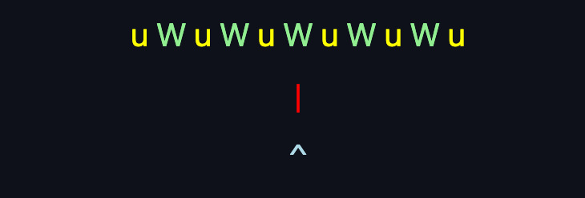
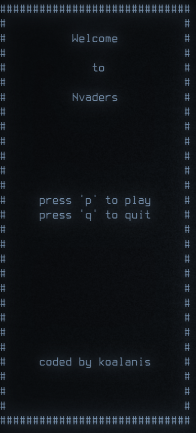
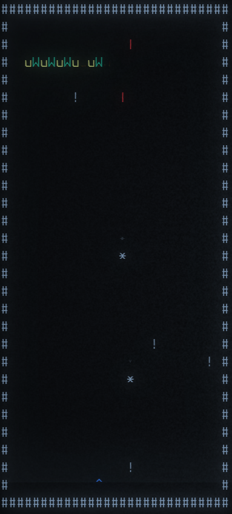

<div align="center">
  
</div>
<h1 align="center">nvaders</h1>
<div align="center"><em>Defend your terminal from the Alien Nvaders</em></div>

 - A tiny Modern C++ ncurses game
 - Tested on osx and linux 
 - Requires [ncurses](https://www.cyberciti.biz/faq/linux-install-ncurses-library-headers-on-debian-ubuntu-centos-fedora/)


To build and clone the repo and then run:
```
cd nvaders
mkdir build && cd build
cmake ..
make
./nvaders
```

Rust clone coming soon...

---

<div align="center">
  
</div>
<div align="center">
  
</div>

Screenshots taken in [cool-retro-term](https://github.com/Swordfish90/cool-retro-term)

---
## TODO
 - Finish ModernC++ migration
 - Add final boss level
