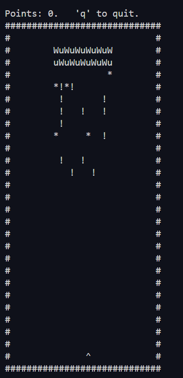

# nvaders

a c++ ncurses game i made in college

very rough, uses make to build
planning on using this to play around with other build systems (yuck)

runs on osx and linux [+ requires ncurses](https://www.cyberciti.biz/faq/linux-install-ncurses-library-headers-on-debian-ubuntu-centos-fedora/)

rust clone coming soon...

